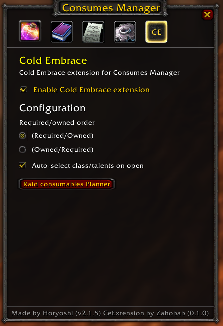
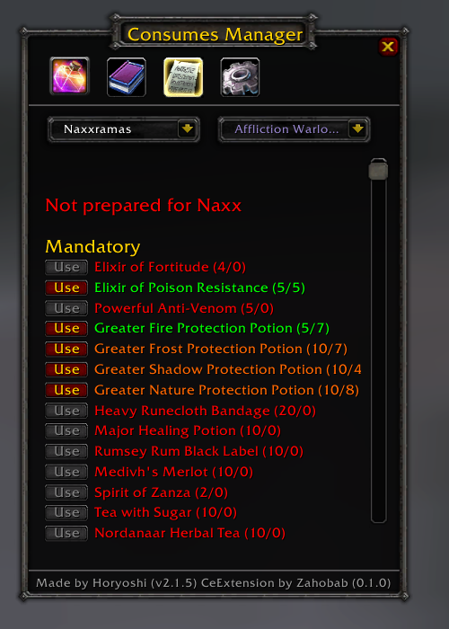
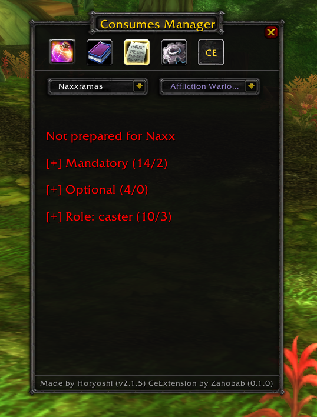

# CeExtension (ConsumesManager CE)

Cold Embrace extension for [ConsumesManager](https://github.com/Cinecom/ConsumesManager?tab=readme-ov-file#) on Turtle WoW. It adds CE-specific presets and role/spec handling to help your raid track required consumables.

## Features
- Optional auto-select of class/talents on open (can be disabled to keep your last selected value).
- Auto-adjusts potion magic damage type requirements by spec.
- Shows required counts alongside owned counts with configurable ordering (Required/Owned or Owned/Required).
- Includes additional consumables not present in the base addon for comprehensive CE readiness.
- Fully compatible with existing ConsumesManager features.
- CE presets and role/spec grouping in the Presets tab.
- Collapsible CE groups with status coloring and completion totals.
- CE tab with extension settings and configuration.
- Raid consumables Planner window with per-raid tabs, class/talent selector, search, “Selected only” filter, and copy-from-raid.
- Non-destructive: base addon remains intact and CE changes are removed when disabled (CE tab remains visible).

## Requirements
- Turtle WoW
- [ConsumesManager](https://github.com/Cinecom/ConsumesManager?tab=readme-ov-file#) (dependency)

## License
This project is released under a non-commercial open source license.
See [LICENSE](LICENSE).

## Installation
1. Download or clone this repository.
2. Copy the CeExtension folder into your addons directory:
   `TurtleWoW/Interface/AddOns/CeExtension`
3. Ensure [ConsumesManager](https://github.com/Cinecom/ConsumesManager?tab=readme-ov-file#) is installed
4. Start the game. On the character select screen, open AddOns and verify both are enabled.

**Preferred: [Git Addon Manager](https://gitlab.com/woblight/GitAddonsManager/-/releases)**
1. Add this repository to Git Addon Manager.
2. Install/update CeExtension through the manager.
3. Ensure [ConsumesManager](https://github.com/Cinecom/ConsumesManager?tab=readme-ov-file#) is installed and enabled.

## Usage
1. Open [ConsumesManager](https://github.com/Cinecom/ConsumesManager?tab=readme-ov-file#) in-game.
2. Go to the CE tab.
3. Check "Enable Cold Embrace extension".
4. Open the Presets tab and select a class/talent.
5. CE groups and requirements will appear.

Planner:
- CE tab -> click "Raid consumables Planner".
- Use the Class/Talent dropdown inside the planner to edit other presets.
- Use Search and “Selected only” to quickly find and review selected consumables.

Auto-select behavior:
- When "Auto-select class/talents on open" is enabled, opening the main window or the planner will auto-detect your current class/spec and switch the class selector.
- Disable it to keep your previously selected class/talents when opening windows.

Optional configuration:
- In the CE tab, choose Required/Owned or Owned/Required to control the order shown in Presets.

   
    
   <em>Enable the extension in the CE tab.</em>

   
    
   <em>View CE requirements in the Presets tab.</em>

   
    
   <em>Collapsed CE groups show completion status.</em>

## How to Switch On/Off
- On: CE tab -> check "Enable Cold Embrace extension".
- Off: CE tab -> uncheck it. The extension restores the original base addon state (CE tab remains available).

